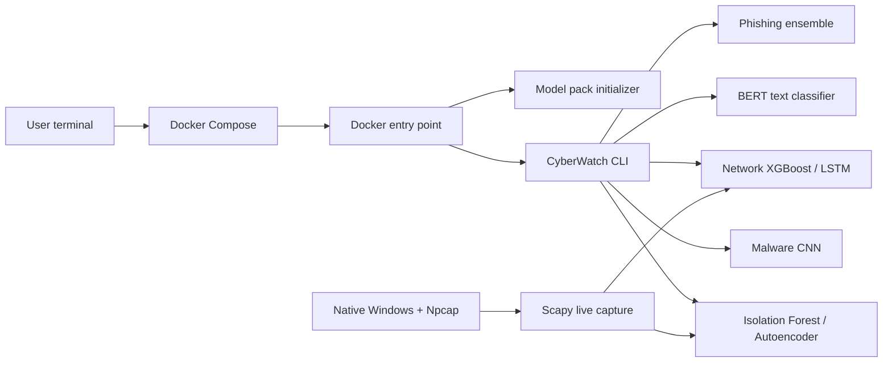

<div align="center">

```text
   ______      __              _       __      __       __
  / ____/_  __/ /_  ___  _____| |     / /___ _/ /______/ /_
 / /   / / / / __ \/ _ \/ ___/ | /| / / __ `/ __/ ___/ __ \
/ /___/ /_/ / /_/ /  __/ /   | |/ |/ / /_/ / /_/ /__/ / / /
\____/\__, /_.___/\___/_/    |__/|__/\__,_/\__/\___/_/ /_/
     /____/        AI V3 — Local Cybercrime Prevention
```

### Local, terminal-first cybercrime detection powered by six machine-learning pipelines

[](https://www.python.org/)
[](https://www.docker.com/)
[](LICENSE)
[](#privacy-first-by-design)

**Built by [Ankit Dash](https://github.com/Ankit-builds1) for the ApexDevs Internship 2026**

</div>

---

## What is CyberWatch AI?

CyberWatch AI V3 is a local cybersecurity inference toolkit for phishing URLs,
harmful text, network flows, malware-memory features, and anomalous traffic. The
primary deployment is a one-command Docker CLI: users clone the repository,
build the image, and run predictions without maintaining a Python environment.

Live Wi-Fi monitoring is also available natively on Windows through Scapy and
Npcap. Prediction inputs stay on the user's machine and no API key is required.

## Capabilities and verified metrics

| Capability | Model | Held-out result |
|---|---|---:|
| Network intrusion classification | XGBoost | **97.14% accuracy** |
| Traffic-burst classification | LSTM | **94.06% accuracy** |
| Phishing URL detection | Random Forest + XGBoost | **93.78% accuracy** |
| Malware family classification | 1D CNN | **97.13% accuracy** |
| Hate/offensive text classification | Fine-tuned BERT | **91.55% accuracy** |
| Zero-day anomaly detection | Isolation Forest + Autoencoder | **80.4% attack detection** |

The V3 training pipeline is available in
[`notebooks/training_v3.ipynb`](notebooks/training_v3.ipynb) and on
[Kaggle](https://www.kaggle.com/code/ankit20554/cyberwatch-ai-v3-complete).

## Architecture



Docker commands run as temporary containers and reuse a named model volume.
Nothing stays running in the background after a command exits.

## Requirements

For the recommended Docker workflow:

- Git
- Docker Desktop using Linux containers
- Approximately 4 GB free RAM
- Approximately 5 GB free disk space for the image and model volume

For native Windows live capture:

- Python 3.10, 3.11, or 3.12
- Npcap
- An Administrator PowerShell terminal

## Quick start — Docker CLI

```powershell
git clone https://github.com/Ankit-builds1/Cyberwatch_ai.git
cd Cyberwatch_ai
docker compose build
docker compose run --rm cyberwatch info
```

The first command that uses the service downloads the V3 model pack into the
`cyberwatch_models` Docker volume. Later commands reuse those files.

## CLI commands

### Scan a URL

```powershell
docker compose run --rm cyberwatch url "http://secure-bank-update.tk/login/verify"
```

### Analyse text

```powershell
docker compose run --rm cyberwatch text "your text here"
```

### Classify network flows

Place a CSV containing the 46 V3 network features in `data/`, then run:

```powershell
docker compose run --rm cyberwatch network --csv /data/flows.csv --limit 100
```

### Detect anomalous traffic

```powershell
docker compose run --rm cyberwatch anomaly --csv /data/flows.csv --sensitivity 0.8
```

Lower sensitivity values raise more alerts. Higher values reduce alerts.

### Classify malware-memory features

Place a CSV containing the 55 CIC-MalMem features in `data/`, then run:

```powershell
docker compose run --rm cyberwatch malware --csv /data/memory_features.csv
```

### Display model metrics

```powershell
docker compose run --rm cyberwatch info
```

### Rebuild after an update

```powershell
git pull
docker compose build --pull
```

### Remove downloaded Docker models

```powershell
docker compose down -v
```

The next CyberWatch command downloads the model pack again.

## Native Windows live monitoring

Docker Desktop cannot directly capture Windows Npcap interfaces. Run the live
monitor natively when you want to observe the laptop's Wi-Fi or Ethernet
traffic.

1. Install [Npcap](https://npcap.com/) with WinPcap-compatible mode enabled.
2. Create the Python environment and download the model pack:

```powershell
py -3.12 -m venv .venv
.\.venv\Scripts\Activate.ps1
python -m pip install --upgrade pip
python -m pip install -r requirements.txt
python download_models.py
```

3. Open PowerShell as Administrator and start capture:

```powershell
python predict.py live --interface "Wi-Fi" --window 2
```

Press `Ctrl+C` to stop monitoring.

> [!IMPORTANT]
> Live packet capture is operational, but its Scapy-derived features approximate
> the original training data. Ordinary traffic can therefore produce false
> positives. A `THREAT` line is an indicative model alert—not proof that the
> computer is under attack.

## Model delivery

The trained artifacts are about 1.5 GB after extraction and are intentionally
excluded from Git. Clean installations download this release asset:

```text
https://github.com/Ankit-builds1/Cyberwatch_ai/releases/download/v3.0/CyberWatch_All_Models_V3.zip
```

To use another trusted location, set `CYBERWATCH_MODELS_URL` before running the
initializer.

## Project structure

```text
Cyberwatch_ai/
├── Dockerfile                 # Reproducible Python CLI image
├── compose.yaml               # One-shot CLI service and model volume
├── docker_entrypoint.py       # Model initialization and command forwarding
├── predict.py                 # Public command-line interface
├── utils.py                   # Model loaders and prediction pipelines
├── live_capture.py            # Native Scapy/Npcap monitoring
├── download_models.py         # GitHub Release model installer
├── requirements-cli.txt       # Container dependencies
├── requirements.txt           # Native CLI/live-capture dependencies
├── data/                      # Read-only CSV mount for Docker commands
├── notebooks/training_v3.ipynb
└── tests/                     # Deployment and model-installer tests
```

## Privacy-first by design

- All inference runs locally.
- No prediction API or cloud account is required.
- Docker exposes no network ports.
- Input CSVs are mounted read-only.
- Model files live in a local Docker volume or local `models/` directory.

## Scope and limitations

- This is an inference and demonstration toolkit, not a replacement for an
  endpoint-detection or incident-response platform.
- URL and text classifications are probabilistic and should be reviewed in
  context.
- Network and malware CSV inputs must follow the feature order saved with the
  released models.
- Live network alerts can contain false positives because capture-time features
  differ from the training distribution.

## License

Released under the [MIT License](LICENSE).

---

<div align="center">

**CyberWatch AI V3 · Built by Ankit Dash · 2026**

</div>
